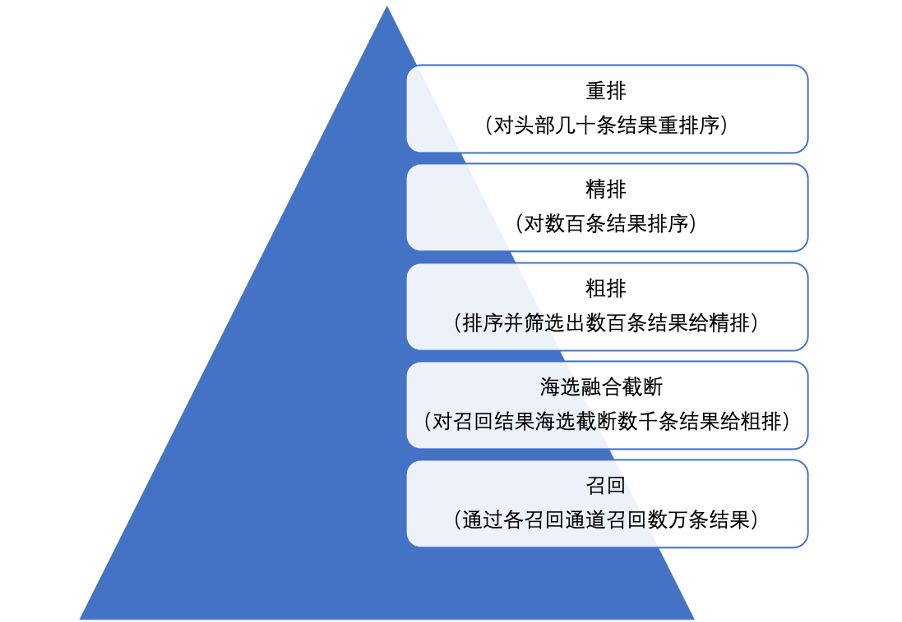

# 搜索系统算法解析

本系列内容为工业领域内当前仍行之有效的普适通用的搜索系统算法策略。

搜索可以抽象成查询理解（Query Parsing 或 Query Processing）、召回（Retrieval）、排序（Ranking），这三部分构成了整个搜索系统的核心，甚至可以作为搜索算法的方法论。

在搜索体系中的各个细分方向下，解析-召回-排序都可以作为一个行之有效的解决问题的思路（即大搜索里套着一个个小搜索），所以本系列将围绕这三个模块展开。

* [Query理解](2.搜索Query解析.pdf)
  * [切词](QueryParsing/QP-1-Query切词.pdf)
  * [词权重](QueryParsing/QP-2-词权重.pdf)
  * [Term改写](QueryParsing/QP-3-Term改写.pdf)
  * [Query改写](QueryParsing/QP-4-Query改写.pdf)
  * [纠错](QueryParsing/QP-5-Query纠错.pdf)
  * [类目](QueryParsing/QP-6-Query类目.pdf)
  * [意图识别](QueryParsing/QP-7-意图识别.pdf)
* [搜索召回](3.搜索-召回.pdf)
  * [倒排召回](Retrieval/召回-1-倒排召回.pdf)
  * [协同过滤召回](Retrieval/召回-2-协同过滤召回.pdf)
  * [向量召回](Retrieval/召回-3-向量召回.pdf)
  * [召回聚合](Retrieval/召回-4-召回聚合.pdf)
* [搜索排序](4.搜索-排序.pdf)
  * [相关性](Ranking/排序-1-相关性.pdf)
  * [粗排](Ranking/排序-2-粗排.pdf)
  * [精排](Ranking/排序-3-精排.pdf)
  * [重排](Ranking/排序-4-重排.pdf)

## 前言

> for New Era

*本文简要介绍了搜索算法流程中的关键节点和技术概要，旨在展现搜索整体结构。*

在如今有关搜索领域的开源技术文章中，其算法策略百花齐放，尤其在细分方向上各有千秋。究其原因，一个角度的思考，搜索算法高度依赖产品定位、生态环境、平台支持、历史背景，作为一个复杂系统，其出发点、选择路径和目标的不同，最后导致该领域在细节上有一定差异化和多样性。

不过，即使如此，在众多的搜索策略中，仍可以抽象出一些统一的方法论，且这种基础的哲学思想具有较高的指导意义，并在搜索大方向和细分领域中处处可见，影响深远。

本章节则从搜索的基本技术概念的介绍出发，逐渐展开工业界曾经通用、常用且有效的算法策略，以抛砖引玉，共同学习。

### 什么是搜索

搜索（Search）是指通过计算机系统来查找、获取信息的过程。它涵盖了从简单的文本匹配到复杂的模式识别和内容理解的各种技术。
在互联网领域中，搜索引擎可以分为两个大类，综合搜索和垂类搜索：

1. **综合搜索（General Search）：** 最常见的搜索形式，用户可以在搜索引擎中输入关键词或短语，搜索引擎会返回与之相关的网页链接、新闻、图片、视频等内容，即搜索结果是非结构化的，用户的检索意图非常多样。典型的代表有Google、百度、Bing等
2. **垂类搜索（Vertical Search）：** 指专门针对某一特定领域或行业的搜索引擎或搜索功能。与通用搜索引擎（如Google、百度）相比，垂类搜索引擎专注于某一特定的主题或领域，提供更为精准和深入的信息检索服务，如：
   - 电商搜索：针对电子商务平台上的商品和服务进行搜索和推荐，常见平台如：淘宝、京东、拼多多、亚马逊
   - 旅游搜索：提供酒店预订、航班查询、旅游攻略、景点介绍等服务，常见平台如：携程、去哪儿、同程
   - 本地生活搜索：专注于本地服务和信息的搜索服务，旨在帮助用户找到附近的商家、服务、活动等，常见平台如：美团、饿了么
   - 地图搜索：主要用于查找地理位置、路线规划等信息。用户可以搜索地点、查看地图、导航等，常见平台如：高德、Google Maps
   - UGC内容搜索：UGC（User Generated Content）内容搜索针对用户生成的内容进行的搜索活动。UGC是指由普通用户而非专业内容创作者创建和分享的内容，常见的平台如：抖音、快手、B站、小红书、知乎

以综合搜索为例，搜索引擎的主要流程包括：

1. **网页抓取**

   通过网络爬虫程序从互联网上收集网页信息。网络爬虫会按照一定的规则遍历互联网上的网页，跟踪页面间的URL链接，并将这些URL收集到一个专门的库中
2. **索引构建**

   抓取到的网页内容会被存储在搜索引擎的数据库中，在构建索引的过程中对网页的内容进行分析和分类，提取关键词和标签，并建立索引以便后续的检索
3. **查询处理**

   当用户输入查询关键词后，搜索引擎会对查询进行处理，以便深入理解用户的查询意图。这个过程包括分词、语义理解等步骤
4. **检索召回**

   根据查询处理的结果，搜索引擎会从网页索引中检索出相关的网页，即使用各种算法（如TF-IDF、BM25、向量空间模型等）对查询和文档进行匹配，并计算文档与查询的相关性得分，返回最相关的文档给到下游
5. **排序**

   对搜索结果进行排序，搜索引擎的排序算法通常会考虑多个因素，包括网页的权重、链接的质量、用户的历史行为等，以提供最符合用户需求的搜索结果
6. **结果展示**

   最后，搜索引擎会将排序后的搜索结果呈现给用户。搜索结果通常包括标题、摘要和链接等信息，用户可以根据搜索结果快速浏览和访问相关网页。此外，搜索引擎还会提供一些额外的功能，如相关搜索、过滤和排序等，以帮助用户更快地找到所需的信息

总之，搜索引擎的工作流程涉及多个关键步骤，从内容数据获取、索引构建、查询解析、检索召回、排序到结果展示和反馈机制。每个步骤都有其特定的功能和作用，共同协作以提供高效、准确和个性化的搜索服务。

### Query 和 Doc

对于用户来说，整个搜索交互过程中，最直接的可以被感知的主要有两块：Query 和 Doc，其中 Query 指用户在检索中自行输入的查询词，反映了用户的需求和意图。检索系统根据 Query 在数据库或索引中查找并返回相关的文档或信息。Doc 可以被认为是检索系统返回给用户的结果，在 Google 中主要就是网页，在淘宝里主要是商品，在抖音中主要就是短视频。

而 Query 和 Doc 的相关性，以及 Doc 本身的内容质量和时效性、个性化等决定了用户搜索满意度。我们可以通过直接或间接的指标以衡量搜索系统的好坏，在后面的文章中，会详细介绍搜索常用指标。

### 搜索三件套：QP-召回-排序

简单来说，搜索可以抽象成查询理解（Query Parsing 或 Query Processing）、召回（Retrieval）、排序（Ranking），这三部分构成了整个搜索系统的核心，甚至可以作为搜索算法的方法论，在各个细分方向中，解析-召回-排序都可以作为一个行之有效的解决问题的思路（即大搜索里套着一个个小搜索），所以本系列将围绕这三个模块展开。

* [QP](QueryParsing)
* [召回](Retrieval)
* [排序](Ranking)

#### QP

查询理解是搜索链路中的第一阶段，主要采用NLP技术实现对 Query 的信息抽取，目的是理解用户需求，并把这个需求通过一系列的处理后交付给下游，建立用户和检索结果的桥梁。

QP 模块中的主要环节有：归一化（简繁转化、表情符处理等）、纠错、分词、词权重（Term Weighting）、NER、Query 改写、类目识别、意图识别等。

* **分词：** 将查询词 Query 切分成一个个独立的、有意义的词或词组，这些词或词组被称为“词元”（Token）。分词主要用在文本召回中，搜索引擎能够将 Doc 中的词汇与 Query 中的词汇进行匹配，从而找到最相关的 Doc，如 Query = “中国最好的搜索引擎推荐”，可以被切分为“中国 最好 的 搜索 引擎 推荐”，搜索引擎则会检索出包含这些词的 Doc
* **词权重：** 对分词后的 Query 中的每个词进行打分，以表示这些词的重要性，当搜索引擎数据库中没有全部包含所有分词的 Doc 的时候，就可以根据词权重选择重要的词进行检索。另外词权重可以用在 Query 和 Doc 的相关性计算中。总之，词权重用来区分哪些词更重要，从而影响文档的排名和相关性
* **Query 改写：** 通过对用户输入的原始查询（Query）进行修改或扩展，旨在解决用户查询中存在的模糊性、不完整性和不准确性等问题（即解决用户输入表达习惯和检索 Doc 表述中存在 gap 的问题）
* **类目识别：** 将 Query 其归类到一个或多个预定义的类目中，如：“iphone” 可以归类为 “科技数码”，“黑悟空” 可以归类为 “游戏”，这一过程有助于搜索引擎更好地理解用户的查询意图，并根据类目信息优化搜索结果的相关性和呈现方式
* **意图识别：** 用来满足搜索 Query 在地域性、时效性等上需求，如时效性意图指用户查询中对于时间敏感度的需求，反映了用户希望获取最新信息或特定时间段内信息的期望，例：“上海空气质量指数” 这个 Query 具备较强的时效性意图，在搜索结果展示的时候需要将最新的数据展出

#### 召回

搜索召回是搜索链路中的第二阶段，即根据用户输入的查询，从海量的 Doc 中筛选出与查询相关的候选集合。召回的目标是尽可能准确和全面，以保证在后续的排序和展示环节提供用户满意的结果。因此，召回环节决定了整个搜索引擎能够提供多少有价值的信息给用户。通常搜索引擎有多个召回通路，并可以分成两种召回方式：文本召回、向量召回。

* **文本召回：** 文本召回通常有两种实现方式，倒排索引召回和KV（Key-Value）索引召回
  * **倒排索引召回：** 将 Doc 中的每个词（而不是每个文档）作为索引的条目，并记录每个词出现在哪些 Doc 中，由此完成索引构建。在查询时的 QP 阶段获取 Query 的分词结果，通过交集运算来找到同时包含这些词的所有 Doc
  * **KV召回：** 主要通过协同过滤的方式离线挖掘和构建 Query-Doc 或 Query-Anchor-Doc 等 KV 关联索引，线上给到 Query 可以通过 Query-Doc 实现 Doc 召回，或根据 Query 扩展出 Anchor，最终实现 Query-Anchor-Doc 的 Doc 召回
* **向量召回：** 近似最近邻搜索（Approximate Nearest Neighbor Search, ANN），在给定查询向量的情况下，从海量数据中快速有效地检索出与查询向量最相关的向量或项目的技术。即将 Query 和 Doc 通过双塔模型学习和获得各自的向量表征，在检索中通过相似度计算（余弦相似度、欧氏距离和Jaccard相似度等）召回相关结果

##### 常见召回通道

| 通道名称     | 召回方式 | 实现方式                                                          |
| ------------ | -------- | ----------------------------------------------------------------- |
| 分词倒排召回 | 文本召回 | 对 Query 进行粗/细粒度分词后采用倒排索引召回                      |
| 丢词召回     | 文本召回 | 对 Query 分词后，保留并采用核心词完成倒排召回                     |
| i2i召回      | 文本召回 | 基于用户历史交互的 Doc（item），召回与这些 Doc 相似的 Doc         |
| 同义词召回   | 文本召回 | 在 QP 阶段获取 Query 的同义词，并用同义词完成 Doc 召回            |
| ANN召回      | 向量召回 | 对 Query 和 Doc 进行向量表征，并通过相似度召回相关的 Query 和 Doc |

在各召回通道完成召回后，通常会有一个聚合模块将各通道结果打分聚合，最终筛选保留数千篇 Doc 给到下游，这个阶段叫做海选。

#### 排序

搜索排序是搜索链路中的第三个阶段，通常是一个粗排 + 精排的二级漏斗逐层过滤 Doc，并在最后通过一些干预策略完成重排。采用粗排 + 精排的策略通常是由于对算力分配的考量，粗排可以采用复杂度低的轻量模型从庞大的候选结果中快速筛选出一个数量较小的候选集，精排阶段则是对粗排筛选出的候选集进行更加精细和复杂的排序。比如在模型选择上，粗排会采用双塔模型，精排会采用单塔模型。

在排序阶段，通常需要计算相关性、点击率、内容质量、时效性等多个分数，并通过这些分数完成排序，具体的：

* 相关性：通常采用 BERT + GBDT 完成对 Doc 的相关性打分（根据算力选择和分配模型）
  * BERT：粗排通常采用双塔6层 BERT，精排通常采用12层 BERT，模型输入通常为`[cls] query [sep] title content [sep]`，其中 title 为 Doc 的标题，content 为 Doc 的主体内容
  * GBDT：输入特征为 BERT 分以及 Query 侧特征、Query-Doc 匹配特征，输出为相关性分数或分档
* 多目标预估：通常采用 DNN 模型，对点击率和交互率（点赞率、收藏率、分享率、关注率、评论率等）进行建模和预估，输入特征一般为 Sparse 和 Dense 两类
  * Sparse 特征：Query、Doc、User、Author 等基础特征，User 的行为特征，Query x Doc 间的交叉特征
  * Dense 特征：Query、Doc、User、Author 等 BERT score 或 embedding特征
* LTR：Learning to Rank，通常采用 GBDT 或 MLP 模型，通常以满意度或点击率为主要目标，输入特征为QP信号、相关性信号、多目标预估信号、Doc 质量信号、时效性信号等
* 重排后处理：通常对排序后前几页内的结果做最后的调序，调序策略一般由产品平台定位设计，比如作者/Doc的流量控制和防御机制，Doc 的多样性需求等，最终通过对 Doc 的加降权以完成重排

### 总结

综上，搜索引擎的流程可以总结为 QP、召回和排序三个阶段，QP 是建立用户查询词 Query 和目标结果 Doc 的桥梁，这个阶段完成了对 Query 的意图理解，并把这个信号传递给下游召回和排序模块。而召回阶段会通过各种召回方式以及多个召回通道，从不同角度去探索检索候选结果的边界，尽可能的在海选阶段把满足检索需求的 Doc 召回回来。排序阶段则通过漏斗过滤的方式，在相关性的约束下对召回候选结果优中选优，并最终呈现给用户。

搜索是个各模块相互依赖的链路，同时每个模块又在相互制约中不断迭代，所以需要各模块目标分明并最大化自有优势，每一次的优化都要结合当前整个链路的现状并相互配合才能发挥彼此最大价值。